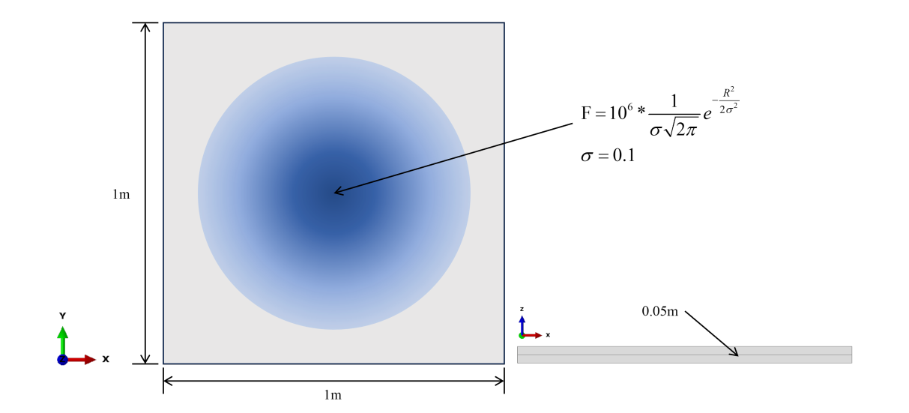
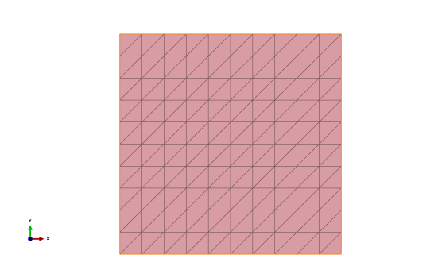
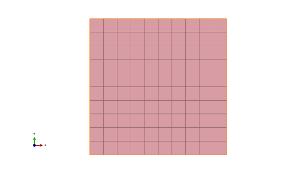

# Computational Mechanics II (Fall 2025)
 
## Assignment 2
**Due Date:** 11:59 pm, Dec 19<sup>th</sup>, 2025
 
### 1. Problem 1 (50%)
Implement the Finite Element method in Matlab for stress analysis of 2D linear elasticity plate problems by completing the predefined Matlab functions.
 
(a) Functions in `main.m`, `plot_results.m`, `quadplot.m` and `constitutive.m` are completed. `main.m` is the main program of the Matlab code, which shows the steps for a Finite Element analysis process. Read the code starting from `main.m` to understand the meaning of our data structures and follow the calling order of the subroutines.
 
```
main.m:        main program of the Matlab code
 
plotresults.m: plot the deformation field and pressure field
 
quadplot.m:    plot the quadrilateral meshes
 
constitutive.m: calculate the strain, stress and the pressure
```
 
(b) Implement the functions marked with "TODO" comments following the instructions in the code:
 
```
Bmatrix.m                  formation of the B matrix
 
Boundary_coditions.m       set up the displacement boundary conditions
 
EnforceBC.m                enforce the essential boundary conditions to degrees of freedoms
 
fextvector.m               formation of the external force vector
 
gcenter.m                  calculate the barycenter of each element
 
mesh.m                     generate the mesh, i.e., node coordinates and element connectivity table
 
Kmatrix.m                  develop the stiffness matrix
```
 
Note that the important data structures defined in the Matlab code are
 
(1)  
$$
x_a = 
\begin{pmatrix}
x^{(1)}\\
x^{(2)}\\
\vdots\\
x^{(N)}
\end{pmatrix},
y_a = 
\begin{pmatrix}
y^{(1)}\\
y^{(2)}\\
\vdots\\
y^{(N)}
\end{pmatrix},
\text{elem} = 
\begin{pmatrix}
I^{(1)} & J^{(1)} & K^{(1)}\\
I^{(2)} & J^{(2)} & K^{(2)}\\
\vdots & \vdots & \vdots\\
I^{(M)} & J^{(M)} & K^{(M)}
\end{pmatrix},
x_g = 
\begin{pmatrix}
x^{(1)}\\
x^{(2)}\\
\vdots\\
x^{(M)}
\end{pmatrix},
y_g = 
\begin{pmatrix}
y^{(1)}\\
y^{(2)}\\
\vdots\\
y^{(M)}
\end{pmatrix}
$$
 
where $x^{(i)}$ and $y^{(i)}$ in $x_a$ are the coordinates of node $i \in \{1,2,..., N\}$, $\{I^{(q)},J^{(q)},...,K^{(q)}\}$ are the indices of the nodes of element $q \in \{1,2,..., M\}$, i.e. `elem` is the connectivity table, and $x^{(q)}$ and $y^{(q)}$ in $x_g$ are the coordinates of the barycenter of element $q$.
 
The $B_M$ matrix is defined as a Matlab cell structure, i.e.,
 
$$
B_M(q) = 
\begin{pmatrix}
\frac{\partial N^{(q)}}{\partial x} & 0 & \frac{\partial N^{(q)}}{\partial x} & 0 & \cdots & \frac{\partial N_K^{(q)}}{\partial x} & 0\\
0 & \frac{\partial N^{(q)}}{\partial y} & 0 & \frac{\partial N^{(q)}}{\partial y} & \cdots & 0 & \frac{\partial N_K^{(q)}}{\partial y}\\
\frac{\partial N^{(q)}}{\partial y} & \frac{\partial N^{(q)}}{\partial x} & \frac{\partial N^{(q)}}{\partial y} & \frac{\partial N^{(q)}}{\partial x} & \cdots & \frac{\partial N_K^{(q)}}{\partial y} & \frac{\partial N_K^{(q)}}{\partial x}
\end{pmatrix}
\text{ for } q \in \{1,2,...,M\}
$$
 
The $B_N$ matrix is defined as a Matlab cell structure, i.e.,
 
$$
B_N(q) = 
\begin{pmatrix}
\frac{\partial N^{(q)}}{\partial x} & 0 & -N^{(q)} & \frac{\partial N^{(q)}}{\partial x} & 0 & -N^{(q)} & \cdots & \frac{\partial N_K^{(q)}}{\partial x} & 0 & -N_K^{(q)}\\
0 & \frac{\partial N^{(q)}}{\partial y} & 0 & 0 & \frac{\partial N^{(q)}}{\partial y} & 0 & \cdots & 0 & \frac{\partial N_K^{(q)}}{\partial y} & 0\\
\frac{\partial N^{(q)}}{\partial y} & \frac{\partial N^{(q)}}{\partial x} & 0 & \frac{\partial N^{(q)}}{\partial y} & \frac{\partial N^{(q)}}{\partial x} & 0 & \cdots & \frac{\partial N_K^{(q)}}{\partial y} & \frac{\partial N_K^{(q)}}{\partial x} & 0
\end{pmatrix}
\text{ for } q \in \{1,2,...,M\}
$$
 
### 2. Problem 2 (50%)
Consider a static linear elasticity isotropic plate problem on a thin plate as shown in Fig. 1. The problem involves a square thin plate with a side length of 1 m and a thickness of 0.05 m.
 

 
All four edges are pinned (i.e. deflection is fixed at 0), and a Gaussian distributed force is applied at the center.
 
$$
F = 10^6 \cdot \frac{1}{\sigma\sqrt{2\pi}} e^{-\frac{R^2}{2\sigma^2}} \text{ (Pa)}
$$
 
where $\sigma=0.1$, and $R$ denotes the distance from the plate center.
 
Material properties include Young's modulus $E=210e9$ Pa and Poisson's ratio $\nu = 0.3$. Plane stress conditions are considered, i.e., the elastic moduli matrix is given by
 
$$
C = \frac{E}{1-\nu^2}
\begin{pmatrix}
1 & \nu & 0\\
\nu & 1 & 0\\
0 & 0 & \frac{1-\nu}{2}
\end{pmatrix}
$$
 
(a) Discretize the domain using 50, 200 and 5000 triangular elements, respectively (Hint: generate the meshes following the pattern shown in Fig. 2(a) and implement your algorithm in the Matlab function named `generate_mesh.m`).
 
    
 
(b) Discretize the domain using 25, 100 and 2500 quadrilateral elements, respectively (Hint: generate the mesh following the pattern shown in Fig. 2(b) and implement your algorithm in the Matlab function named `generatemesh.m`).
 
(c) Employ the Matlab code obtained from Problem 1 to solve for the maximum rotation, deflection, stress, and strain distributions across the problem domain.
 
(d) Solve the problem in Abaqus or COMSOL, or other commercial software and validate your solution against the one obtained in commercial software by comparing the output field.